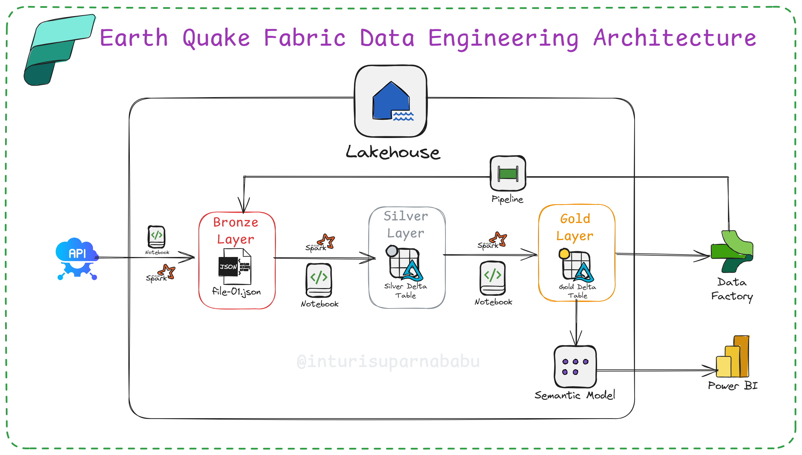

# 🌍 Earthquake Data Engineering with Microsoft Fabric

A complete end-to-end data pipeline project using **Microsoft Fabric**, built on real-time **Earthquake API data**. This project follows the **Medallion Architecture** (Bronze → Silver → Gold) and culminates in an interactive **Power BI** dashboard.

> 📌 Business Case  
Earthquake data is crucial for public safety, urban planning, insurance risk assessment, and scientific research. By building a robust pipeline, we ensure stakeholders receive **automated, up-to-date, enriched insights**—without manual intervention.

---

## 🧠 Architecture Overview

> This diagram shows the architecture used for extracting, transforming, and visualizing earthquake data using Microsoft Fabric.

---

## 🏗️ Project Workflow

### 1. 🟫 Bronze Layer – Raw Ingestion
- ✅ Created a Workspace: `Earthquake_WS`
- ✅ Created a Lakehouse: `earthquake_LH`
- ✅ Created `bronze_notebook` in Spark (attached to Lakehouse)
- ✅ Ingested JSON data from Earthquake API into raw zone
- ✅ Stored as: `file-01.json`

### 2. 🪞 Silver Layer – Cleansed Data
- ✅ Created `silver_notebook`
- ✅ Loaded raw data from Bronze Lakehouse
- ✅ Transformed structure, handled missing/nulls
- ✅ Converted timestamp fields
- ✅ Appended to a Silver Delta Table

### 3. 🥇 Gold Layer – Enriched Insights
- ✅ Created `gold_notebook`
- ✅ Registered UDFs for reverse geocoding using `reverse_geocoder` PyPI lib
- ✅ Added `country_code`, `city`, and significance classification
- ✅ Stored enriched output to Gold Delta Table

---

## ⚙️ Data Factory Automation
- ✅ Created Pipeline: `earthquake-pipeline`
- ✅ Added `bronze_notebook`, `silver_notebook`, `gold_notebook` activities
- ✅ Configured base parameters for each
- ✅ Fully orchestrated end-to-end execution

---

## 📊 Power BI Integration
- ✅ Created a **Semantic Model** using `earthquake_events_gold` Delta table
- ✅ Auto-generated Power BI report from Lakehouse table
- ✅ Real-time dashboard with refreshable data insights

---

## 💡 Technologies Used
- Microsoft Fabric (Lakehouse, Notebooks, Data Factory)
- Apache Spark (PySpark)
- Power BI
- Python (reverse_geocoder)
- Delta Tables
- Earthquake API (USGS)

---

## 🔁 Final Thoughts
This project demonstrates how to turn raw public data into a refined analytical solution using **Microsoft Fabric**. With **medallion architecture**, **automated pipelines**, and **Power BI**, the system delivers insights that are fast, reliable, and impactful.

---
### 📽️ Demo Video  
Want to practice or see how it works in action?

👉 **Watch this tutorial:**  

🔗 [Do you want to practice? Watch this on YouTube](https://www.youtube.com/watch?v=P7EqW6_7wKs)

##  Thak you all :)

