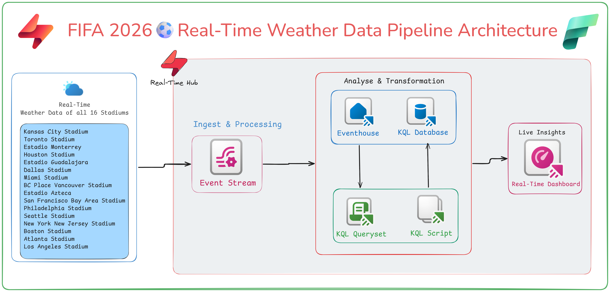

# ⚽ FIFA World Cup 2026 - Real-Time Weather Intelligence using Microsoft Fabric

> **A Real-Time Intelligence solution built using Microsoft Fabric to monitor live weather conditions across all FIFA World Cup 2026 stadiums.**

---

## 📖 Overview

Weather plays a crucial role in outdoor sporting events, especially during a global tournament like the FIFA World Cup 2026. Extreme heat, high humidity, rainfall, and strong winds can directly impact player performance, spectator safety, and match operations.

This project demonstrates how **Microsoft Fabric Real-Time Intelligence** can ingest, process, analyze, and visualize live weather data from all **16 FIFA World Cup 2026 stadiums**.

Using **Eventstreams**, **Eventhouse**, **KQL Database**, and **Real-Time Dashboards**, this solution provides a centralized operational view that enables organizers to make informed decisions based on live weather conditions.

---

# 🏗️ Solution Architecture

The architecture below illustrates the complete Real-Time Intelligence pipeline built in Microsoft Fabric.

<p align="center">
  
</p>

---

## 🚀 Features

* 🌦️ Live Weather Data Ingestion
* ⚡ Microsoft Fabric Eventstreams
* 🗄️ Eventhouse & KQL Database
* 📊 Real-Time Dashboard
* 🌍 Weather Monitoring for all 16 FIFA Stadiums
* 🌡️ Heat Alert Monitoring (Wet Bulb Temperature)
* 💨 Wind Speed Analysis
* 🌧️ Rainfall Tracking
* 💧 Humidity Monitoring
* 📍 Interactive Stadium Map
* 📈 Live Operational KPIs

---

## 🛠️ Microsoft Fabric Components Used

* Microsoft Fabric Real-Time Intelligence
* Eventstreams
* Eventhouse
* KQL Database
* Kusto Query Language (KQL)
* Real-Time Dashboard

---

## 📂 Repository Structure

```text
FIFA-2026-Real-Time-Intelligence/
│
├── README.md
├── fifa2026-rti-archetecture.png
├── Dashboard/
│   └── FIFA_2026_Weather_Dashboard.json
├── KQL/
│   └── FIFA2026_Weather_Queries.kql
├── Images/
│   └── Screenshots
└── Blog/
    └── FIFA2026_Real_Time_Intelligence_Blog.pdf
```

---

## 📊 Dashboard Highlights

The dashboard provides real-time visibility into:

* Stadium-wise Weather Status
* Live Temperature
* Wet Bulb Temperature Alerts
* Rainfall Monitoring
* Wind Speed
* Humidity
* Interactive Stadium Map
* Real-Time Operational KPIs

---

## 📁 Included Files

This repository contains:

* ✅ Architecture Diagram
* ✅ Dashboard JSON File
* ✅ KQL Queries
* ✅ Blog Document
* ✅ Supporting Screenshots

You can import the dashboard JSON into Microsoft Fabric and execute the KQL scripts to recreate the complete solution.

---

## 🎯 Business Use Cases

This solution can help organizations:

* Improve player safety
* Monitor extreme weather conditions
* Plan match operations proactively
* Trigger heat alerts
* Support tournament decision-making
* Demonstrate Microsoft Fabric Real-Time Intelligence capabilities

The same architecture can also be adapted for:

* Smart Cities
* Manufacturing
* Logistics
* Healthcare
* Airports
* Public Safety
* IoT Monitoring

---

## 📚 Prerequisites

Before getting started, ensure you have:

* Microsoft Fabric Workspace
* Fabric Real-Time Intelligence enabled
* Eventstreams
* Eventhouse
* KQL Database
* Dashboard permissions

---

## 🚀 Getting Started

1. Clone this repository.
2. Open Microsoft Fabric.
3. Create an Eventhouse.
4. Create an Eventstream.
5. Connect the Real-Time Weather Public Feed.
6. Configure Eventhouse as the destination.
7. Run the provided KQL queries.
8. Import the Dashboard JSON.
9. Start monitoring live weather across FIFA 2026 stadiums.

---

## 💡 Learning Outcomes

By completing this project, you'll learn how to:

* Build Real-Time Intelligence solutions
* Work with Eventstreams
* Store streaming data in Eventhouse
* Write KQL queries
* Design Real-Time Dashboards
* Build end-to-end streaming analytics solutions in Microsoft Fabric

---

## 🤝 Contributing

Contributions, suggestions, and improvements are always welcome.

If you have ideas to enhance this project, feel free to fork the repository, open an issue, or submit a pull request.

---

## ⭐ Support

If you found this repository useful, please consider giving it a ⭐ Star.

Sharing it with the Microsoft Fabric community is also greatly appreciated!

---

## 👨‍💻 Author

**Inturi Suparna Babu**

Microsoft Fabric & Data Engineering Enthusiast

🔗 LinkedIn: https://www.linkedin.com/in/inturi-suparna-babu-312b59270/

---

## 🙏 Acknowledgements

Special thanks to the Microsoft Fabric community for inspiring innovative Real-Time Intelligence solutions.

Happy Learning! 🚀
