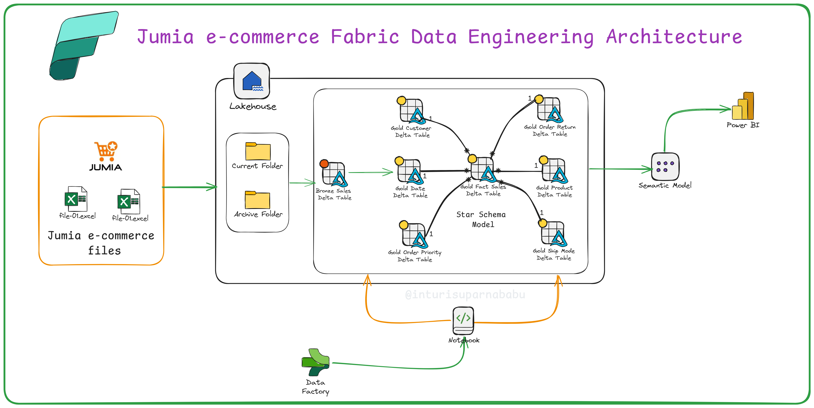

# 🛒 Jumia E-Commerce Sales - Microsoft Fabric Data Engineering Project

## 🚀 Overview

This end-to-end data engineering project was implemented using **Microsoft Fabric**, simulating a real-world E-Commerce sales pipeline using **Jumia sales data**. The project demonstrates advanced capabilities including data ingestion, transformation, orchestration, and semantic modeling—all in a unified Fabric workspace.

---

## 🧱 Project Structure

- **Workspace**: `Ecommerce-Project-WS`
- **Lakehouse**: `ECOMP-PROJ-LH`
  - Subfolders:
    - `/Current`
    - `/Archive`

---

## 🗂️ Data Ingestion

- Uploaded the raw **Sales** and **Returns** Excel files into the `Current` folder.
- Created **Lakehouse tables** by reading these files using notebooks.

---

## 🔧 Data Transformation (Bronze Layer)

- Created initial notebook `Bronze_Sales`:
  - Read and joined Sales and Returns data on `Order ID`.
  - Cleaned unnecessary columns.
  - Created a **temporary view** to transform into the Bronze table.
  - Merged records into the Bronze table using `SparkSQL`.

---

## 🥇 Gold Layer Tables (Dimension & Fact)

Each gold table was created using dedicated notebooks with incremental loading:

### 🧩 Dimension Tables

- `Gold_Returns`
- `Gold_OrderPriority`
- `Gold_ShipMode`
- `Gold_Customer`
- `Gold_Product`
- `Gold_Date`

Special steps included:
- Using `monotonically_increasing_id()` for surrogate keys.
- Generating custom date ranges (`2015-01-01` to `2030-12-31`) for the date dimension.
- Schema enforcement and versioned loading.

### 📊 Fact Table

- `Gold_Fact_Sale` created using merged views and updated using `MERGE` statements.

---

## 📦 Data Archival

- Implemented archival notebook:
  - Used mount paths and file system operations to **move ingested files from `/Current` to `/Archive`**.

---

## 🧬 Pipeline Orchestration

- Created a central `Run_Load` notebook to invoke all other notebooks sequentially.
- Built a **Microsoft Fabric Data Pipeline** to execute this notebook end-to-end.
- ✅ **Pipeline executed successfully.**

---

## 📈 Semantic Model & Power BI

- Built a **Semantic Model** on top of Gold tables.
- Imported the model into **Power BI Desktop**.
- Created a fully interactive **Power BI Report** for sales analysis.
- Established relationships between Fact and Dimension tables.

---

## 📊 Key Highlights

| Feature                          | Count         |
|----------------------------------|---------------|
| ✅ Pipelines Created             | 1             |
| 📓 Notebooks Used                | 10+           |
| 📚 Semantic Models               | 1             |
| 📊 Power BI Reports              | 1             |

---

## 📎 Resources

- 🎥 [Video Guide](https://youtu.be/vK9tDFuhQ6Y?si=6LKzsbaegZ5M0cfe)
- 📂 [Project Architecture Diagram](ProjectArchetecture.png)

---

🔗 **Project done by**: 👨‍💼 [Inturi Suparna Babu](https://www.linkedin.com/in/inturi-suparna-babu-312b59270/)

## 🙌 Acknowledgements

This project is inspired by real-world data challenges in the e-commerce domain and leverages the full capabilities of **Microsoft Fabric’s Lakehouse architecture** and **Power BI analytics**.

---

⭐ *If you found this helpful, please consider giving the repo a star and following me on LinkedIn for more data engineering content!*

