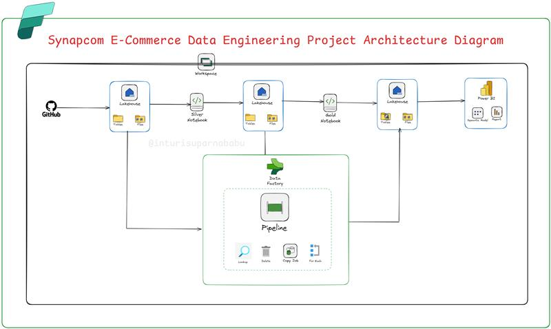

# Synapcom E-Commerce Analytics – End-to-End Microsoft Fabric Data Engineering Project

## 📌 Project Overview
This project demonstrates an **End-to-End E-Commerce Analytics Data Engineering Pipeline** using **Microsoft Fabric Medallion Architecture** (Bronze → Silver → Gold layers).  
It includes **structured and unstructured data ingestion**, transformation using **Fabric Notebooks**, and final **Power BI reporting** built on a semantic model.

**Grateful to Reena for her exceptional teaching and guidance** – this project wouldn’t have been possible without her support.

---

## 🏗 Architecture

The solution follows the **Medallion Architecture**:
- **Bronze Layer** → Raw data ingestion (Structured + Unstructured)
- **Silver Layer** → Data cleaning, transformation, and normalization
- **Gold Layer** → Aggregated and curated datasets for analytics & reporting

---

## 📂 Datasets Used
- **Structured Files**:  
  - `orders_data.csv`  
  - `customers.csv`  
  - `products.csv`  

- **Unstructured Files**:  
  - `reviews.json`  
  - `social_media.json`  
  - `web_logs.json`  

---

## 🛠 Microsoft Fabric Services Used
- **Lakehouse** (Bronze, Silver, Gold)
- **Data Pipelines**
- **Notebooks** (PySpark / Pandas transformations)
- **Power BI Semantic Model**
- **Power BI Service for Reporting**

---

## 📜 Detailed Steps

### 1️⃣ Workspace & Architecture Setup
- Created a workspace **`Synapcom-ShoppingMart-Analytics-WS`**.
- Selected **pre-designed Medallion Architecture task flow**.

---

### 2️⃣ Bronze Layer – Data Ingestion
#### Structured Data
1. Created Lakehouse **`ShoppingMart_BronzeLayer_LH`**.
2. Created pipeline **`ShoppingMart_DataIngest_Bronze_pipeline`**.
3. Added **Copy Data Activity** (`Copy_ShoppingMart_BronzeLayer_UsingAPI`) with **HTTP Connector**.
4. Configured source API URL & tested connection ✅.
5. Destination set as `ShoppingMartBronze/Orders`.
6. Pipeline run → Orders file successfully created in Bronze Lakehouse.
7. Copied activity for **metadata ingestion** (`Copy_ShoppingMart_MetaData`).
8. Loaded metadata into `ShoppingMart_SourceMetadata/StructuredDataFiles`.
9. Added **Lookup** and **ForEach** activities to loop over structured CSV files.
10. All 3 CSV files successfully ingested into Bronze Lakehouse.

#### Unstructured Data
1. Saved structured pipeline as `ShoppingMart_Unstructured_DataIngest_Bronze_pipeline`.
2. Modified source & destination for unstructured JSON files.
3. Configured lookup & ForEach activities.
4. Successfully ingested all 3 unstructured JSON files into Bronze Lakehouse.

---

### 3️⃣ Silver Layer – Transformation
1. Created Lakehouse **`ShoppingMart_SilverLayer_LH`**.
2. Developed transformation notebook **`NotebookSilverTransformationsShoppingMartData`**.
3. Created **shortcuts** to read from Bronze Lakehouse.
4. Cleaned structured data → wrote results as parquet files in Silver Layer.
5. Created shortcuts for unstructured data → transformed & stored in Silver Layer as parquet.

---

### 4️⃣ Gold Layer – Aggregation & Curation
1. Created Lakehouse **`ShoppingMart_GoldLayer_LH`**.
2. Created notebook **`NotebookGoldTransformation_ShoppingMart`**.
3. Created shortcuts to Silver Layer data.
4. Performed business aggregations & transformations.
5. Wrote final curated datasets to Gold Lakehouse (Parquet format).

---

### 5️⃣ Delta Tables & Semantic Model
1. Loaded final datasets as **Delta Tables**.
2. Created a **Semantic Model** from Gold Layer tables.
3. Built relationships between fact & dimension tables.
4. Created a **Date Table** and linked it with Orders.
5. Adjusted datatypes and column formatting.

---

### 6️⃣ Power BI Reporting
1. Built Power BI report **directly in Fabric Service** on the Semantic Model.
2. Created visualizations for key KPIs, trends, and sales insights.

---

### 7️⃣ Master Orchestration Pipeline
1. Created **`ShoppingMart_Master_pipeline`**.
2. Added **Invoke Pipeline** for Structured Ingestion.
3. Added **Invoke Pipeline** for Unstructured Ingestion.
4. Added **Notebook Activity** for Silver Layer transformations.
5. Added **Notebook Activity** for Gold Layer transformations.
6. Ran the Master Pipeline → all processes executed successfully ✅.

---

## 📊 Final Output
- **Automated ingestion** of structured & unstructured data.
- **Clean, aggregated datasets** stored in Lakehouse.
- **Semantic model** with relationships for reporting.
- **Power BI dashboards** providing e-commerce analytics insights.

---

## 🔗 References
- **YouTube Walkthrough**: [https://www.youtube.com/watch?v=qG65DUcSjws](https://www.youtube.com/watch?v=qG65DUcSjws)  
- **GitHub Repo**: *Add your repo link here*  

---

## 📌 Tags
`#MicrosoftFabric` `#DataEngineering` `#PowerBI` `#MedallionArchitecture` `#ECommerceAnalytics` `#DataPipelines` `#FabricCommunity`

