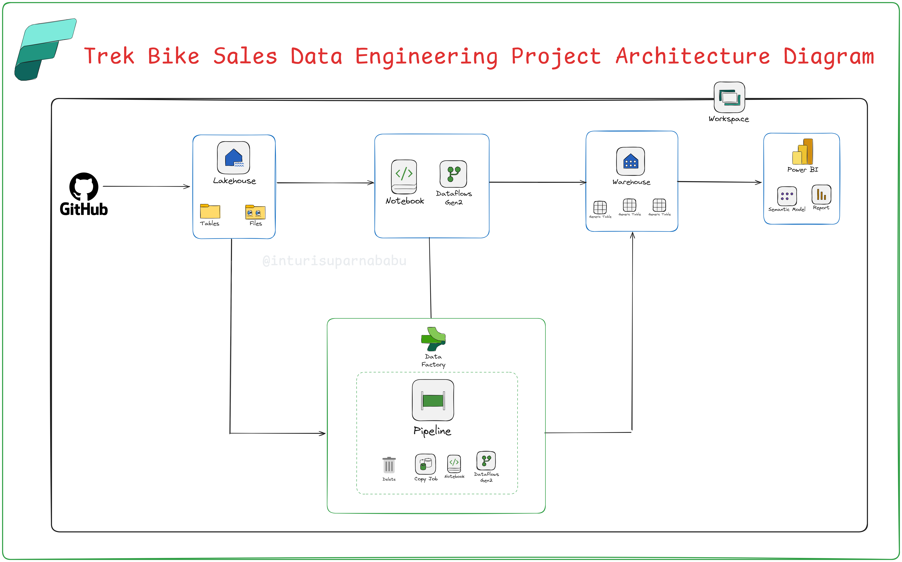

# 🚴 Trek Bike Sales Analysis – End-to-End Project (Microsoft Fabric)

This project demonstrates an **end-to-end data engineering and analytics pipeline** built using **Microsoft Fabric**. The workflow covers **data ingestion, transformation, modeling, and reporting** for Trek Bike Sales data.

---

## 📌 Project Overview
The objective of this project is to design and implement a **data pipeline** that ingests raw sales data, transforms it into meaningful insights, and builds a semantic model to enable interactive reporting in Power BI.

---

## 🏗️ Architecture

---

## 🔑 Steps Followed

### 1. Workspace & Storage Setup
- Created a workspace: **`Trek-BikeSales-WS`**
- Created a warehouse: **`TrekBikeSales-DWH`**
- Created a lakehouse: **`DataStagingLakehouse`**

### 2. Data Ingestion (Pipeline)
- Created a pipeline: **`Rawdataingest`**
- Added **Copy Data Activity** to pull sales data from GitHub using API.
- Configured **HTTP connector** with GitHub source URL.
- Destination: Lakehouse → Sub-folder **`sourcefiles`**.
- Verified pipeline execution → **Sales_Data.csv** successfully loaded into Lakehouse.

### 3. Data Transformation (Notebook)
- Created a notebook: **`Bike Sales Analytics Notebook`**.
- Performed transformations and loaded output as **Delta Table** into Lakehouse.
- Configured pipeline with:
  - **Delete Activity** (to clean old data).
  - **Notebook Activity** (to execute transformations).
- Verified → **`new_sales` Delta Table** successfully created in Lakehouse.

### 4. Dataflow Gen2 Transformations
- Created **`DataflowTransformations`**.
- Connected to **DataStagingLakehouse** → selected **`new_salesdata`** table.
- Applied transformations.
- Destination: Lakehouse → Replace existing **`new_salesdata`** table.
- Pipeline executed successfully with transformed data available.

### 5. Data Warehouse Schema
- Created **Sales Schema** with **Fact** and **Dimension tables**.
- Created **Staging View** in DWH from Lakehouse (`new_salesdata`).
- Developed **Stored Procedure** to insert data into Fact & Dim tables.
- Executed procedure → Data successfully populated.

### 6. Semantic Model & Reporting
- Built **Semantic Model** on top of Data Warehouse.
- Defined **relationships** between Fact & Dimension tables.
- Created a **Calendar Table** and linked with Fact data.
- Enabled **Power BI auto-report generation** from Semantic Model.

---

## 📊 Final Deliverables
- **Lakehouse with Delta Tables** (raw + transformed data).
- **Warehouse with Fact & Dim Tables**.
- **Semantic Model for reporting**.
- **Power BI Reports** generated automatically.

---

## 📚 Resources Used
- 📺 YouTube Tutorial: [Trek Bike Sales Analysis in Microsoft Fabric](https://youtu.be/tBkvwY1ShA0?si=7C4rr_bRfCzojfzH)  
- 🖼️ Architecture Diagram: `Trek.arche.png`  

---

## 🚀 Tools & Technologies
- **Microsoft Fabric**
- **Data Lakehouse**
- **Pipelines (Data Ingestion & Orchestration)**
- **Notebooks (Transformation)**
- **Dataflow Gen2**
- **Data Warehouse (DWH)**
- **Power BI (Semantic Model & Reports)**

---

## ✨ Key Learnings
- How to orchestrate end-to-end data pipelines in Microsoft Fabric.
- Transforming and storing data as **Delta tables** in Lakehouse.
- Automating **Fact & Dimension loading** using Stored Procedures.
- Creating **Semantic Models** for Power BI reporting.

---

🔗 **Project done by**: 👨‍💼 [Inturi Suparna Babu](https://www.linkedin.com/in/inturi-suparna-babu-312b59270/)

## 🙌 Acknowledgements

This project is inspired by real-world data challenges in the e-commerce domain and leverages the full capabilities of **Microsoft Fabric’s Lakehouse architecture** and **Power BI analytics**.

---

⭐ *If you found this helpful, please consider giving the repo a star and following me on LinkedIn for more data engineering content!*

