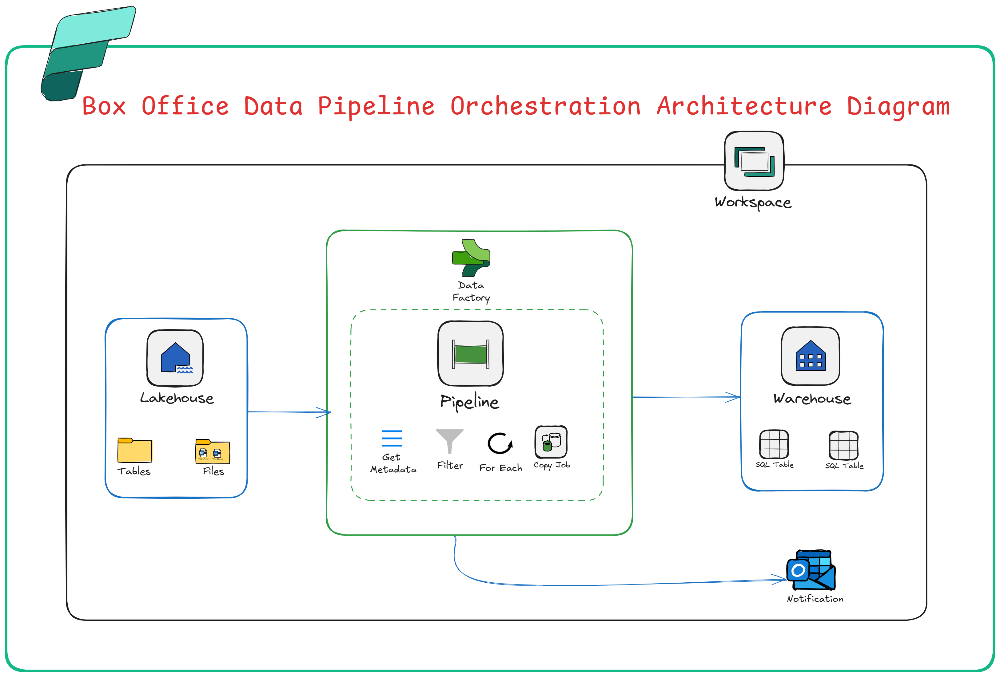

# 🎬 Indian Box Office Data Pipeline – Microsoft Fabric Project

This project demonstrates an **end-to-end data engineering workflow** in **Microsoft Fabric**, moving raw CSV data from a Lakehouse to a Warehouse using Data Pipelines — complete with filtering, automation, and email notifications.

---

## 📌 Project Overview

**Objective:**  
Ingest, filter, and store box office datasets for multiple Indian film industries (Bollywood, Kollywood, Mollywood, Sandalwood, and Tollywood) using Microsoft Fabric.

**Key Outcomes:**  
- Created dedicated tables for each film industry.  
- Automated data movement from Lakehouse to Warehouse.  
- Set up email notifications for pipeline completion.  

---

## 🛠️ Tools & Technologies Used
- **Microsoft Fabric**
- **Lakehouse & Warehouse**
- **Data Pipelines**
- **Get Metadata & Filter Activities**
- **For Each Activity**
- **Copy Data Activity**
- **Office 365 Outlook Notifications**

---

## 📂 Steps Performed

1. **Workspace Creation** – `Data_Demo_WS`
2. **Lakehouse Setup** – `boxoffice_LH`
3. **Data Upload** – 52 CSV files uploaded to Lakehouse folder
4. **Warehouse Creation** – `boxoffice_WH`
5. **Pipeline Development** – `BO_PIPELINE`
6. **Get Metadata Activity** – Captured file details
7. **Filter Activities** – Separated datasets for:
   - Bollywood
   - Kollywood
   - Mollywood
   - Sandalwood
   - Tollywood
8. **For Each + Copy Data** – Moved filtered data into Warehouse tables
9. **Email Notifications** – Configured for each film industry
10. **Pipeline Execution** – Successfully loaded all datasets

---

## 📊 Architecture

---

## 🚀 Final Output
- **Warehouse Tables:**
  - `Bollywood`
  - `Kollywood`
  - `Mollywood`
  - `Sandalwood`
  - `Tollywood`
- Automated process for future dataset ingestion

---

## 🎥 Upcoming
A **full video tutorial** will be released soon — covering the complete step-by-step build of this project in Microsoft Fabric.

---

## 📢 Stay Connected
For more projects, follow **me** on:
- [LinkedIn](https://www.linkedin.com/in/inturi-suparna-babu-312b59270/)

---

**#MicrosoftFabric #DataPipeline #LakehouseToWarehouse #DataEngineering #FabricCommunity #Automation**

